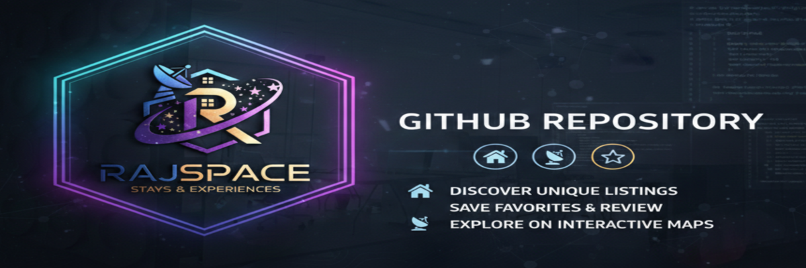
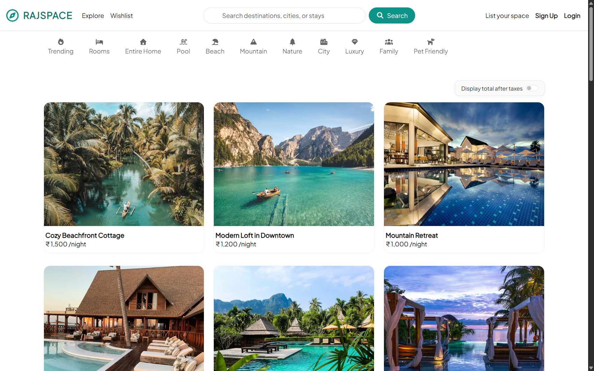
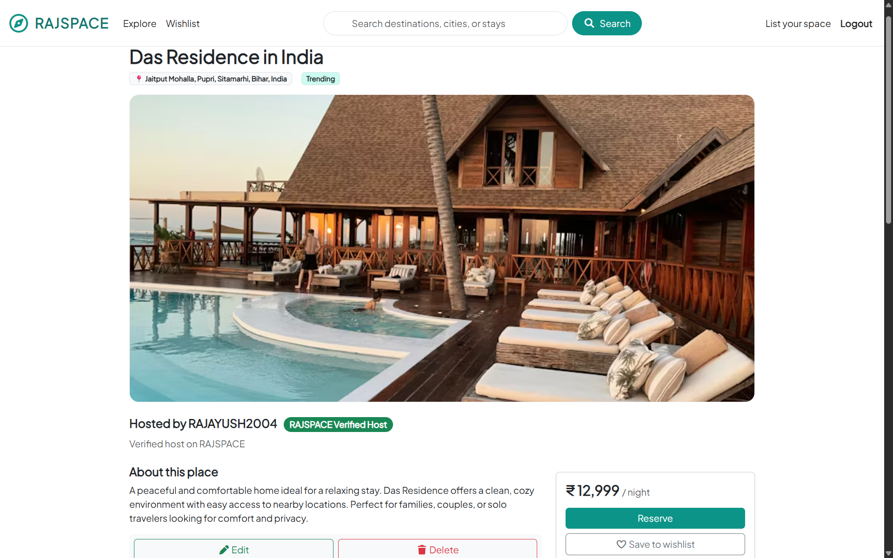
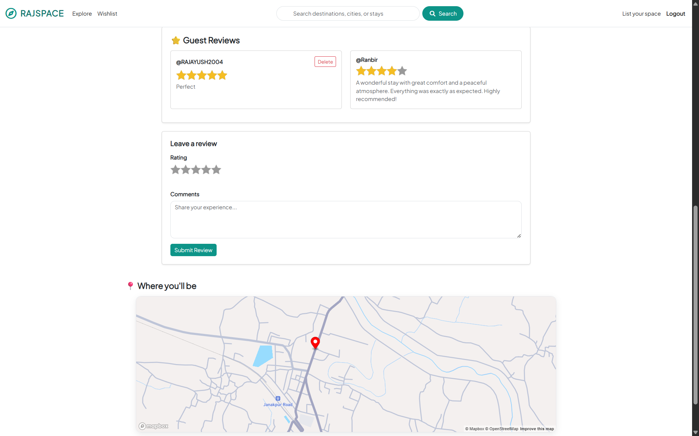
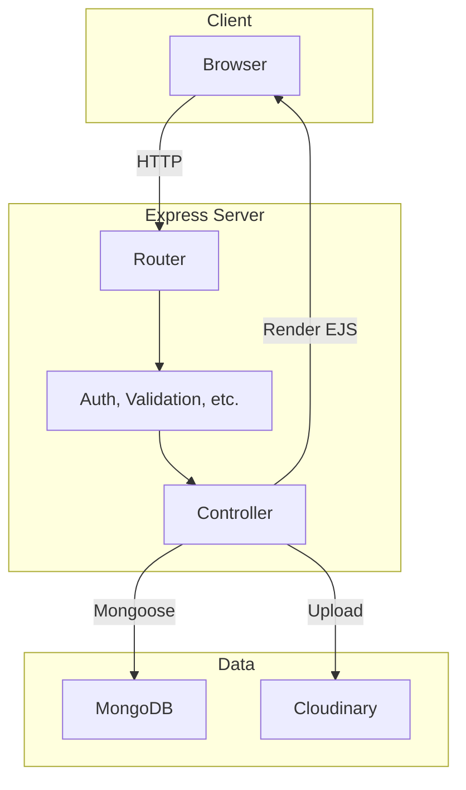
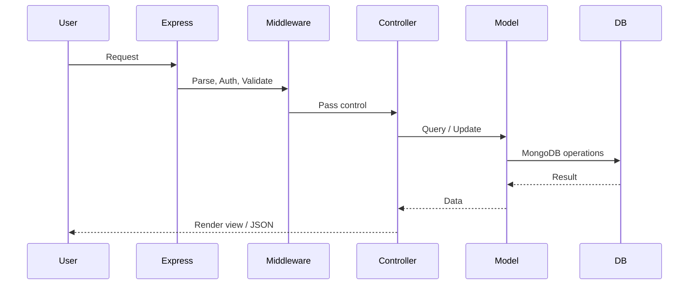
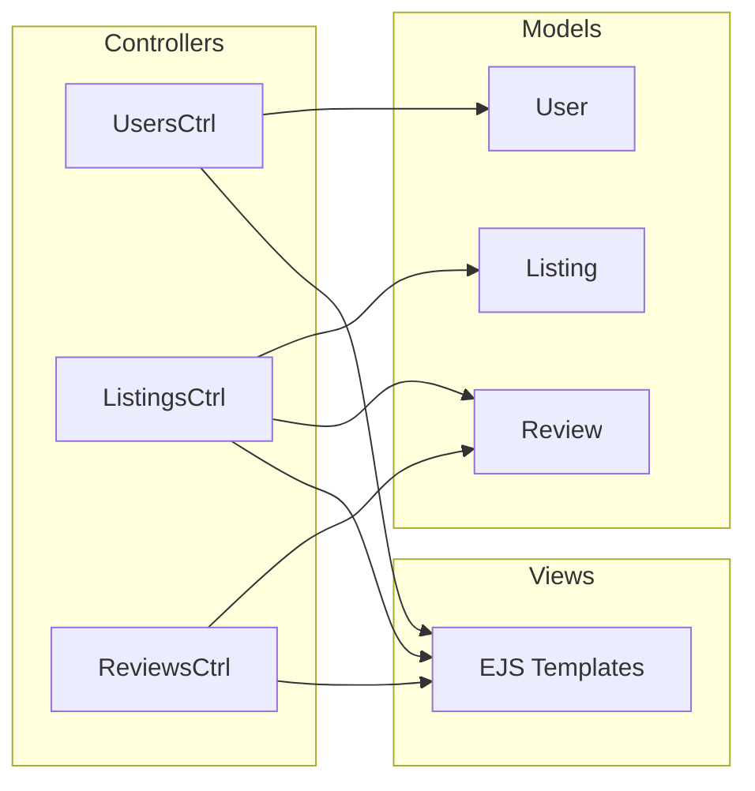
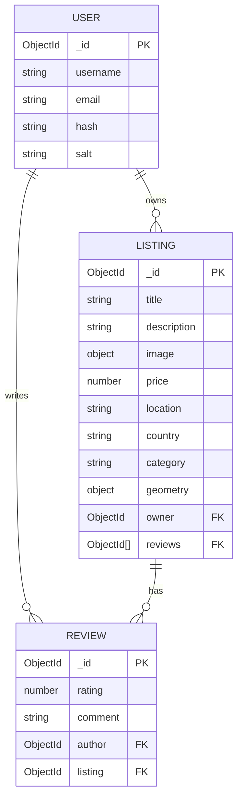

<div align="center">

# RAJSPACE

### Stays & Experiences — Discover, List, and Book Unique Places

<!-- Banner - Add your banner to assets/banner.png -->


<br/>

[](https://nodejs.org/)
[](https://expressjs.com/)
[](https://www.mongodb.com/)
[](https://ejs.co/)
[](https://getbootstrap.com/)
[](https://www.mapbox.com/)
[](https://cloudinary.com/)
[](http://www.passportjs.org/)
[](LICENSE)

**Production-Ready** · **MVC Architecture** · **Full CRUD** · **RESTful API** · **Session Auth** · **Responsive UI**

[Live Demo](https://rajspace.onrender.com/) ·
[Features](#-features) ·
[Architecture](#-architecture) ·
[Quick Start](#-quick-start) ·
[Documentation](#-documentation) ·
[Contributing](#-contributing)

</div>

---

## Table of Contents

- [Overview](#-overview)
- [Live Demo](#-live-demo)
- [Screenshots](#-screenshots)
- [Features](#-features)
- [Tech Stack](#-tech-stack)
- [Architecture](#-architecture)
- [Database Schema](#-database-schema)
- [Project Structure](#-project-structure)
- [Prerequisites](#-prerequisites)
- [Quick Start](#-quick-start)
- [Environment Variables](#-environment-variables)
- [API Reference](#-api-reference)
- [Deployment](#-deployment)
- [Security](#-security)
- [Performance](#-performance)
- [Roadmap](#-roadmap)
- [Contributing](#-contributing)
- [FAQ](#-faq)
- [Acknowledgments](#-acknowledgments)
- [License](#-license)
- [Author](#-author)

---

## Overview

**RAJSPACE** is a full-stack, production-grade stays and experiences platform built with modern web technologies. Discover unique listings, save favorites to your wishlist, list your own space, leave reviews, and explore properties on interactive maps — all with a clean, responsive UI and robust authentication.

> **Note:** This project is suitable for portfolios, learning, and as a base for production deployments. Built with best practices including MVC separation, validation, error handling, and security hardening.

| Aspect | Details |
|--------|---------|
| **Type** | Full-stack web application |
| **Architecture** | MVC (Model-View-Controller) |
| **Auth** | Session-based (Passport.js Local Strategy) |
| **Database** | MongoDB with Mongoose ODM |
| **Rendering** | Server-side (EJS with ejs-mate layouts) |
| **Styling** | Bootstrap 5 + custom teal theme |
| **Deployment** | Node.js hosting compatible (Render, Railway, Heroku, etc.) |

---

## Live Demo

| Environment | URL |
|-------------|-----|
| **Production** | `https://rajspace.onrender.com` |
| **Local** | `http://localhost:8080` |

---

## Screenshots

<table>
  <tr>
    <td align="center"><b>Home / Explore</b></td>
    <td align="center"><b>Listing Detail</b></td>
  </tr>
  <tr>
    <td></td>
    <td></td>
  </tr>
  <tr>
    <td align="center"><b>Category Filter</b></td>
    <td align="center"><b>Map & Reviews</b></td>
  </tr>
  <tr>
    <td></td>
    <td></td>
  </tr>
  <tr>
    <td align="center"><b>Create Listing</b></td>
    <td align="center"><b>Login / Auth</b></td>
  </tr>
  <tr>
    <td></td>
    <td></td>
  </tr>
</table>

---

## Features

### Core Features

| Feature | Description | Status |
|---------|-------------|--------|
| **Explore & Search** | Browse stays by category, search by location/keyword | ✅ |
| **Wishlist** | Session-based wishlist; save and manage favorites | ✅ |
| **Full CRUD** | Create, read, update, delete your own listings | ✅ |
| **Reviews** | Star ratings + comments; authors can delete own reviews | ✅ |
| **Host Badge** | RAJSPACE Verified Host badge on listings | ✅ |
| **Review Analytics** | Average rating and review count on listing pages | ✅ |
| **Interactive Maps** | Mapbox-powered maps showing listing locations | ✅ |
| **Image Upload** | Cloudinary integration for listing images | ✅ |
| **Auth** | Sign up, login, logout with Passport.js | ✅ |
| **Responsive UI** | Bootstrap 5 + custom teal theme; mobile-friendly | ✅ |
| **Legal Pages** | Privacy Policy and Terms of Service | ✅ |
| **Flash Messages** | Success/error feedback via connect-flash | ✅ |

### Technical Highlights

- **MVC architecture** — Clear separation of models, views, controllers
- **Validation** — Joi schemas for listings and reviews
- **Async error handling** — `wrapAsync` utility for clean try/catch
- **Middleware pipeline** — `isLoggedIn`, `isOwner`, `validateListing`, `validateReview`
- **MongoDB sessions** — `connect-mongo` for persistent sessions
- **Environment-based config** — dotenv for secrets

---

## Tech Stack

<details>
<summary><b>View full dependency tree</b></summary>

| Category | Technology | Purpose |
|----------|------------|---------|
| **Runtime** | Node.js 24 | JavaScript runtime |
| **Framework** | Express 5 | Web server, routing, middleware |
| **Database** | MongoDB | NoSQL document store |
| **ODM** | Mongoose | Schema, validation, population |
| **Auth** | Passport.js (local) | Session-based authentication |
| **Session** | express-session + connect-mongo | Persistent sessions in MongoDB |
| **Templates** | EJS + ejs-mate | Server-side rendering, layouts |
| **UI** | Bootstrap 5, Font Awesome | Components, icons |
| **Validation** | Joi | Request/schema validation |
| **File Upload** | Multer + multer-storage-cloudinary | Image uploads to Cloudinary |
| **Maps** | Mapbox Geocoding + Mapbox GL JS | Geocoding, interactive maps |
| **Utilities** | method-override, connect-flash | REST verbs, flash messages |

</details>

---

## Architecture

### High-Level Flow



### Request Lifecycle



### MVC Structure



---

## Database Schema

### Entity Relationship Diagram



### Listing Categories

`Trending` · `Rooms` · `Entire Home` · `Pool` · `Beach` · `Mountain` · `Nature` · `City` · `Luxury` · `Family` · `Pet Friendly`

---

## Project Structure

```
rajspace/
├── 📁 assets/                    # Logo, banner (add your images here)
│   ├── logo.png
│   └── banner.png
├── 📁 screenshots/               # Website screenshots
│   ├── home.png
│   ├── category.png
│   ├── create.png
│   ├── listinginfo.png
│   ├── login.png
│   └── mapandreviews.png
├── 📁 controllers/
│   ├── listings.js               # Listing CRUD, show with populate & reviewStats
│   ├── reviews.js                # Create/delete reviews
│   └── users.js                  # Signup, login, logout
├── 📁 init/
│   ├── index.js                  # Seed script
│   └── data.js                   # Sample listing data
├── 📁 middleware.js              # isLoggedIn, isOwner, validateListing, validateReview, saveRedirectUrl
├── 📁 models/
│   ├── listing.js                # Listing schema (owner, reviews, geometry, category)
│   ├── review.js                 # Review schema (author, rating, comment)
│   └── user.js                   # User schema (passport-local-mongoose)
├── 📁 routes/
│   ├── legal.js                  # /privacy-policy, /terms-of-service
│   ├── listing.js                # /listings CRUD
│   ├── review.js                 # /listings/:id/reviews
│   ├── user.js                   # /signup, /login, /logout
│   └── wishlist.js               # /wishlist GET/POST/DELETE
├── 📁 public/
│   ├── css/
│   │   ├── style.css             # Main styles
│   │   └── rating.css            # Starability rating component
│   └── js/
│       ├── script.js             # Client-side logic
│       └── map.js                # Mapbox integration
├── 📁 utils/
│   ├── ExpressError.js           # Custom error class
│   └── wrapAsync.js              # Async route wrapper
├── 📁 views/
│   ├── layouts/
│   │   └── boilerplate.ejs       # Base layout (navbar, footer, flash)
│   ├── includes/
│   │   ├── navbar.ejs
│   │   ├── footer.ejs
│   │   └── flash.ejs
│   ├── listings/
│   │   ├── index.ejs             # Explore / home
│   │   ├── show.ejs              # Listing detail
│   │   ├── new.ejs               # Create form
│   │   ├── edit.ejs              # Edit form
│   │   └── reserve.ejs           # Reservation confirmation
│   ├── users/
│   │   ├── login.ejs
│   │   └── signup.ejs
│   ├── wishlist/
│   │   └── index.ejs
│   ├── legal/
│   │   ├── privacy-policy.ejs
│   │   └── terms-of-service.ejs
│   └── error.ejs                 # 404, 500 error page
├── app.js                        # Entry point, Express config, route mounting
├── cloudConfig.js                # Cloudinary configuration
├── schema.js                     # Joi validation schemas
├── package.json
├── .env                          # Environment variables (not in git)
└── README.md
```

---

## Prerequisites

Before you begin, ensure you have the following installed:

| Requirement | Version | Check Command |
|-------------|---------|---------------|
| **Node.js** | 24.x (LTS) | `node -v` |
| **npm** | 10.x+ | `npm -v` |
| **MongoDB** | 7.x (local or Atlas) | `mongod --version` |

---

## Quick Start

### 1. Clone the repository

```bash
git clone https://github.com/https://github.com/Programmer-Ayush-Raj/RAJSPACE.git
cd rajspace
```

### 2. Install dependencies

```bash
npm install
```

### 3. Environment setup

Create a `.env` file in the project root:

```bash
cp .env.example .env
# Edit .env with your values
```

### 4. Seed the database (optional)

```bash
npm run seed
```

Creates user `rajspace-seed` (password: `seed-pass-123`) and sample listings.

### 5. Start the server

```bash
npm start
```

Visit **http://localhost:8080** — root redirects to `/listings`.

---

## Environment Variables

| Variable | Required | Description | Example |
|----------|----------|-------------|---------|
| `ATLASDB_URL` | ✅ | MongoDB connection string | `mongodb://127.0.0.1:27017/rajspace` |
| `SECRET` | ✅ | Session secret (long random string) | `your-super-secret-key-here` |
| `MAP_TOKEN` | ✅ | Mapbox public access token | `pk.eyJ1...` |
| `CLOUDINARY_CLOUD_NAME` | ✅ | Cloudinary cloud name | `your-cloud` |
| `CLOUDINARY_API_KEY` | ✅ | Cloudinary API key | `123456789` |
| `CLOUDINARY_API_SECRET` | ✅ | Cloudinary API secret | `your-secret` |
| `NODE_ENV` | ❌ | `production` \| `development` | `development` |

> **Tip:** For local MongoDB: `ATLASDB_URL=mongodb://127.0.0.1:27017/rajspace`

---

## API Reference

### Public Routes

| Method | Path | Description |
|--------|------|-------------|
| `GET` | `/` | Redirect to `/listings` |
| `GET` | `/listings` | List all listings (`?category=`, `?q=` supported) |
| `GET` | `/listings/:id` | Listing detail (owner & reviews populated) |
| `GET` | `/privacy-policy` | Privacy Policy page |
| `GET` | `/terms-of-service` | Terms of Service page |

### Auth Routes

| Method | Path | Description |
|--------|------|-------------|
| `GET` | `/signup` | Signup form |
| `POST` | `/signup` | Register new user |
| `GET` | `/login` | Login form |
| `POST` | `/login` | Login (Passport local) |
| `GET` | `/logout` | Logout |

### Protected Routes (Auth Required)

| Method | Path | Description |
|--------|------|-------------|
| `GET` | `/listings/new` | New listing form |
| `POST` | `/listings` | Create listing |
| `GET` | `/listings/:id/edit` | Edit form (owner only) |
| `PUT` | `/listings/:id` | Update listing (owner only) |
| `DELETE` | `/listings/:id` | Delete listing (owner only) |
| `POST` | `/listings/:id/reviews` | Create review |
| `DELETE` | `/listings/:id/reviews/:reviewId` | Delete review (author only) |
| `GET` | `/wishlist` | Wishlist page |
| `POST` | `/wishlist/:id` | Add to wishlist |
| `DELETE` | `/wishlist/:id` | Remove from wishlist |
| `GET` | `/listings/:id/reserve` | Reservation confirmation |

---

## Deployment

### Platform Options

| Platform | Docs | Notes |
|----------|------|-------|
| **Render** | [Render Node.js](https://render.com/docs/deploy-node-express-app) | Free tier, easy MongoDB Atlas |
| **Railway** | [Railway](https://docs.railway.app/) | Simple env vars, add-ons |
| **Heroku** | [Heroku Node.js](https://devcenter.heroku.com/categories/nodejs-support) | Requires credit card for add-ons |
| **Vercel** | [Vercel Serverless](https://vercel.com/docs/functions) | Requires serverless adaptation |
| **DigitalOcean** | [App Platform](https://docs.digitalocean.com/products/app-platform/) | Full control |

### Deployment Checklist

- [ ] Set `NODE_ENV=production`
- [ ] Use MongoDB Atlas for production DB
- [ ] Configure all env vars in platform
- [ ] Enable HTTPS (most platforms do this by default)
- [ ] Add custom domain (optional)

---

## Security

- **Passwords:** Hashed with `passport-local-mongoose` (pbkdf2)
- **Sessions:** Stored in MongoDB; `httpOnly` cookies
- **Validation:** Joi schemas prevent invalid/malicious input
- **Owner checks:** `isOwner` middleware protects edit/delete
- **Sanitization:** EJS escapes output by default
- **Secrets:** Never commit `.env`; use platform env vars in production

---

## Performance

- **MongoDB indexes:** Consider indexes on `listing.owner`, `listing.category`, `listing.geometry`
- **Static assets:** Served via `express.static`
- **Session store:** `connect-mongo` with `touchAfter` to reduce writes
- **Image optimization:** Cloudinary handles resizing and CDN delivery

---

## Roadmap

- [ ] **Payments** — Stripe or Razorpay for reservations
- [ ] **Persistent wishlist** — Store in DB per user
- [ ] **Host badge tiers** — Superhost / verified based on reviews
- [ ] **Admin panel** — Moderate users and listings
- [ ] **Booking calendar** — Availability and date-based booking
- [ ] **Email** — Notifications, password reset
- [ ] **Real-time** — Socket.io for live updates

---

## Contributing

Contributions are welcome! Please follow these steps:

1. **Fork** the repository
2. **Create** a feature branch: `git checkout -b feature/amazing-feature`
3. **Commit** your changes: `git commit -m 'Add amazing feature'`
4. **Push** to the branch: `git push origin feature/amazing-feature`
5. **Open** a Pull Request

---

## FAQ

<details>
<summary><b>Seed user credentials?</b></summary>

After `npm run seed`: **Username:** `rajspace-seed` · **Password:** `seed-pass-123`

</details>

<details>
<summary><b>How do I get Mapbox/Cloudinary keys?</b></summary>

- **Mapbox:** [mapbox.com](https://www.mapbox.com/) → Account → Access tokens
- **Cloudinary:** [cloudinary.com](https://cloudinary.com/) → Dashboard → API Keys

</details>

---

## Acknowledgments

- [Express](https://expressjs.com/) — Fast, minimalist web framework
- [MongoDB](https://www.mongodb.com/) — Flexible document database
- [Bootstrap](https://getbootstrap.com/) — UI components
- [Mapbox](https://www.mapbox.com/) — Maps and geocoding
- [Cloudinary](https://cloudinary.com/) — Image hosting
- [Font Awesome](https://fontawesome.com/) — Icons

---

## License

This project is licensed under the **ISC License** — see the [LICENSE](#-LICENSE) file for details.

---

## Author

<div align="center">

**Ayush Raj**

[](https://www.linkedin.com/in/ayush-raj0709/)
[](https://github.com/Programmer-Ayush-Raj)
[](mailto:rajayush6200@email.com)

**RAJSPACE** — Stays & Experiences · Built with ❤️ by Ayush

</div>
